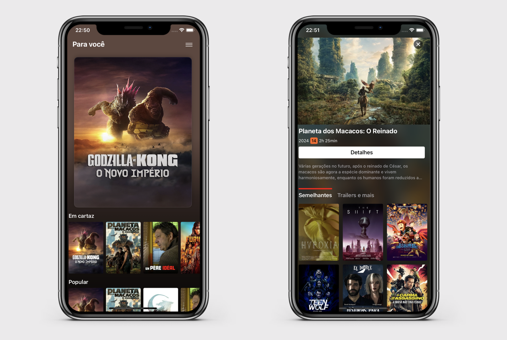

# ⚠️ YSMovie - Work in progress

YSMovie is an iOS Movie app that consumes TMDB APIs.  
The purpose of this project is to create an iOS App with a UI inspired by the Netflix App, including it's amazing transitions and interactions.  
App is built using UIKit + VIPER architecture + Combine

## Interface

## Content studied and applied during development:
- UICollectionView
  - UICollectionViewDiffableDataSource
  - UICollectionViewCompositionalLayout
  - UICollectionView.CellRegistration
  - UICollectionViewLayutListConfiguration
- UITableView
  - UITableViewDataSource
  - UITableViewDelegate
- UIContentUnavailableConfiguration (iOS 17+)
- Localization (PT + EN)
- Dynamic Font Types (Accessibility)
- Animations
  - UIViewControllerTransitionDelegate
  - UIViewControllerContextTransitioning
  - UIViewPropertyAnimator

## TO-DO
- [ ] Make custom transition interruptible; 
- [ ] Refactor Movie Details View;
- [ ] Improve async image loading;
- [ ] Implement custom video player for trailers;
